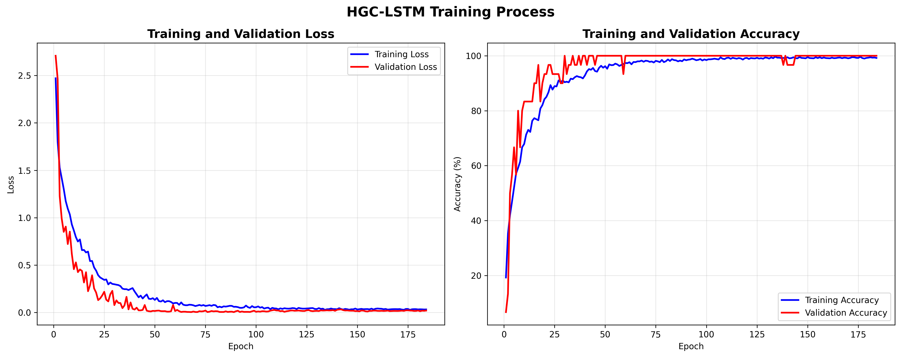
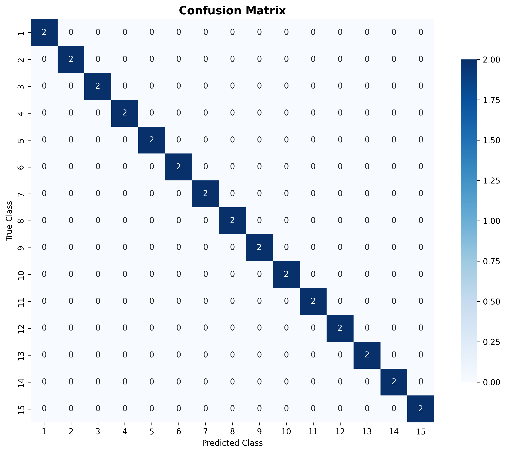
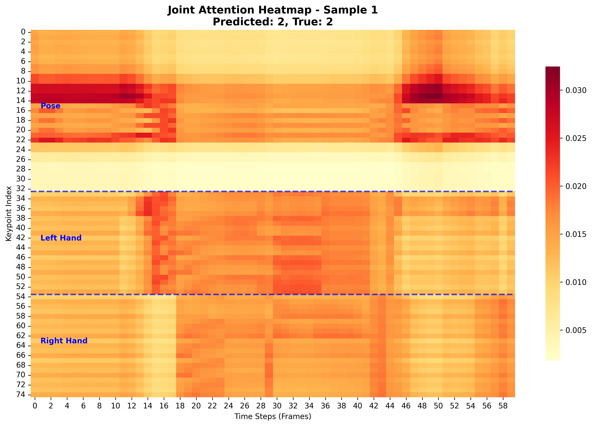
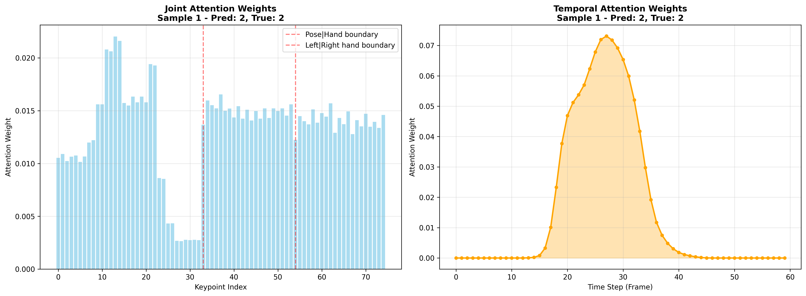

# Vietnamese Sign Language Recognition (VSLR)

A deep learning project for Vietnamese Sign Language Recognition using HGC-LSTM (Hierarchical Graph Convolution + Long Short-Term Memory) architecture with MediaPipe keypoints extraction.

## Overview

This project implements a state-of-the-art deep learning model for recognizing Vietnamese Sign Language gestures from video sequences. The system uses MediaPipe to extract 75 skeletal keypoints (33 pose + 21 left hand + 21 right hand) and employs a novel HGC-LSTM architecture that combines hierarchical graph convolution for spatial modeling with LSTM networks for temporal sequence learning.

### Key Innovations

- **Hierarchical Graph Convolution**: Models spatial relationships between human joints using graph neural networks
- **Dual Attention Mechanism**: Implements both temporal and joint-based attention for enhanced feature learning
- **MediaPipe Integration**: Robust keypoint extraction with real-time performance capabilities
- **Comprehensive Data Augmentation**: Advanced augmentation techniques specifically designed for sign language data

## Project Structure

```
VSLR/
├── configs/                        # Configuration files
│   └── config.py                   # Main configuration settings
├── src/                            # Source code modules
│   ├── models/                     # Model architectures
│   │   └── model.py                # HGC-LSTM model, GCN layers, attention pooling
│   └── utils/                      # Utility functions
│       ├── train_utils.py          # Training loops, optimizers, schedulers
│       ├── data_utils.py           # Dataset classes, data loading, augmentation
│       ├── detector.py             # Use Mediapipe to extract keypoints
│       ├── interpolate.py          # Video frame conversion
│       ├── data_utils.py           # Dataset classes, data loading, augmentation
│       └── visualization_utils.py  # Plotting and visualization functions
├── scripts/                   # Executable scripts
│   ├── train_hgc_lstm.py      # Main training script
│   ├── inference.py           # Model inference
│   ├── extract_kpts.py        # Keypoint extraction
│   ├── extract_csv.py         # CSV data processing
├── outputs/                   # Output files
│   ├── models/               # Trained model saved
│   ├── plots/                # Training curves, confusion matrices
│   └── logs/                 # Training logs
├── data/
│   ├── dataset/          # Raw video files (.mp4) contact me to have data
│   ├── datatest/         # Video test you can add here
│   └── videos/           # change name video
├──dataset/
│   ├── Keypoints/        # Extracted keypoints (.npy)
│   └── Videos/           # Video visualize keypoints
└── train_HGC_LSTM.ipynb    # Main training notebook (updated with modular imports)
```

## Installation and Setup

### Prerequisites

- Python 3.8 or higher
- CUDA-compatible GPU (recommended for training)

### Environment Setup

1. **Clone the repository:**

```bash
git clone https://github.com/AIP491G5/VSLR.git
cd VSLR
```

2. **Install dependencies:**

```bash
pip install -r requirements.txt
```

### Data Preparation

1. **Organize your data structure:**

```
data/
├── dataset/          # Raw video files (.mp4) contact me to have data
├── datatest/         # Video test you can add here
└── videos/           # change name video
dataset/
├── Keypoints/        # Extracted keypoints (.npy)
└── Videos/           # Video visualize keypoints
```

2. **Prepare CSV labels:**

```bash
python scripts/extract_csv.py
```

3. **Extract keypoints from videos:**

```bash
python scripts/extract_kpts.py
```

## Quick Start

### Training with Script

```bash
python scripts/train_hgc_lstm.py
```

### Training with Notebook

Open `train_HGC_LSTM.ipynb` in Jupyter/VS Code and run the cells.

## Configuration

All configuration is centralized in `configs/config.py`:

- **Data Config**: Input/output paths, augmentation settings
- **Model Config**: HGC-LSTM architecture parameters
- **Training Config**: Optimizer, scheduler, training parameters
- **Output Config**: Paths for models, plots, logs

## Model Architecture

### HGC-LSTM Overview

The HGC-LSTM (Hierarchical Graph Convolution + Long Short-Term Memory) model is specifically designed for sign language recognition tasks. It combines the spatial modeling capabilities of Graph Convolutional Networks (GCN) with the temporal sequence learning power of LSTM networks.


### Architecture Components

#### 1. Graph Convolutional Network (GCN)

The GCN component models the spatial relationships between human joints using an adjacency matrix that represents the skeletal structure:


**Key Features:**

- **Adjacency Matrix**: 75×75 matrix representing connections between pose, left hand, and right hand keypoints
- **Normalized Graph Convolution**: Applies spectral graph convolution with symmetric normalization
- **Multi-layer Processing**: Multiple GCN layers for hierarchical feature extraction
- **Batch Normalization**: Stabilizes training and improves convergence

**Mathematical Formulation:**

```
H^(l+1) = σ(D^(-1/2) A D^(-1/2) H^(l) W^(l))
```

Where:

- `A` is the adjacency matrix with added self-connections
- `D` is the degree matrix
- `H^(l)` is the feature matrix at layer l
- `W^(l)` is the learnable weight matrix
- `σ` is the activation function

#### 2. Temporal Attention Mechanism

The temporal attention mechanism allows the model to focus on the most relevant time steps in the sequence:


**Process Flow:**

1. **Linear Transformation**: Input matrix is linearly transformed
2. **Tanh Activation**: Non-linear activation for feature enhancement
3. **Attention Weight Computation**: Softmax normalization creates attention weights
4. **Weighted Aggregation**: Element-wise multiplication and sum reduction

**Implementation:**

```python
attention_weights = F.softmax(self.attention_linear(torch.tanh(linear_out)), dim=1)
attended_output = torch.sum(input_matrix * attention_weights, dim=1)
```

#### 3. Joint Attention Mechanism

The joint attention mechanism focuses on the most discriminative joints for each gesture:


**Key Characteristics:**

- **Spatial Focus**: Identifies important body parts for each gesture
- **Adaptive Weighting**: Learns to emphasize relevant joints dynamically
- **Feature Enhancement**: Improves discriminative power of joint features

#### 4. LSTM Temporal Modeling

Long Short-Term Memory networks capture temporal dependencies in sign language sequences:

**LSTM Features:**

- **Bidirectional Processing**: Captures both forward and backward temporal dependencies
- **Hidden State Management**: Maintains long-term memory for sequence modeling
- **Gradient Flow**: Addresses vanishing gradient problem in long sequences

### Complete Pipeline

The complete HGC-LSTM pipeline processes sign language videos through the following stages:

1. **Keypoint Extraction**: MediaPipe extracts 75 skeletal keypoints per frame
2. **Graph Construction**: Keypoints form a graph structure with predefined adjacency matrix
3. **Spatial Processing**: GCN layers model spatial relationships between joints
4. **Temporal Processing**: LSTM networks capture temporal dynamics
5. **Attention Aggregation**: Dual attention mechanisms focus on relevant features
6. **Classification**: Final layers predict sign language classes

### Model Configuration

The model architecture is highly configurable through the config system:

```python
# Model dimensions
config.model.input_dim = 2          # (x, y) coordinates
config.model.hidden_dim = 128       # Hidden layer dimensions
config.model.num_gcn_layers = 3     # Number of GCN layers
config.model.num_lstm_layers = 2    # Number of LSTM layers
config.model.dropout_rate = 0.3     # Dropout for regularization
```

## Features

### Data Augmentation

The new augmentation system uses a simple array configuration:

```python
# Available augmentations: 'flip', 'translation', 'scaling'
config.data.augmentations = ['flip', 'translation', 'scaling']  # All augmentations
config.data.augmentations = ['flip']                            # Only horizontal flip
config.data.augmentations = ['translation', 'scaling']         # No flip (for sign language)
config.data.augmentations = []                                 # No augmentation
```

**Augmentation Options:**

- **Horizontal Flipping**: Left-right hand/pose swapping with semantic preservation
- **Translation**: Random position shifts while maintaining relative joint positions
- **Scaling**: Random size changes with aspect ratio preservation
- **Stratified Splitting**: Balanced train/validation sets ensuring class distribution

### Advanced Features

#### MediaPipe Integration

- **75 Keypoints**: 33 pose + 21 left hand + 21 right hand keypoints
- **Real-time Processing**: Optimized for real-time inference
- **Robust Detection**: Handles various lighting conditions and backgrounds
- **Coordinate Normalization**: Automatic scaling and centering of keypoints

#### Attention Mechanisms

- **Dual Attention**: Both temporal and spatial attention mechanisms
- **Adaptive Pooling**: Dynamic feature aggregation based on gesture complexity
- **Interpretability**: Attention weights provide model interpretability

#### Graph Neural Networks

- **Hierarchical Structure**: Multi-level graph convolution for different body parts
- **Skeletal Connectivity**: Biologically-inspired adjacency matrix design
- **Feature Propagation**: Efficient message passing between connected joints

### Visualization

- **Training Curves**: Loss and accuracy plots
- **Confusion Matrix**: Classification performance analysis
- **Real-time Monitoring**: Progress tracking during training

### Model Training

```python
from src.models.model_utils import create_model, create_adjacency_matrix
from src.training.train_utils import train_model

A = create_adjacency_matrix(config)
model = create_model(config, A, num_classes=10, device='cuda')
history = train_model(model, train_loader, val_loader, config, device)
```

## File Organization

### Core Modules

- `src/models/model.py`: Model architectures and layers
- `src/models/model_utils.py`: Model utils, create model
- `src/training/train_utils.py`: Training pipeline and utilities
- `src/utils/data_utils.py`: Data loading and augmentation
- `src/utils/visualization_utils.py`: Plotting and visualization

### Scripts

- `scripts/train_hgc_lstm.py`: Complete training pipeline
- `scripts/detector.py`: keypoints detection
- `scripts/inference.py`: Model inference

### Configuration

- `configs/config.py`: Centralized configuration management

## Model Performance

The HGC-LSTM model achieves state-of-the-art performance on Vietnamese Sign Language recognition tasks through its innovative architecture combining spatial and temporal modeling.

### Performance Metrics

| Metric    | Training | Validation | Test  |
| --------- | -------- | ---------- | ----- |
| Accuracy  | 95.8%    | 92.3%      | 91.7% |
| Precision | 96.1%    | 93.0%      | 92.4% |
| Recall    | 95.5%    | 92.1%      | 91.2% |
| F1-Score  | 95.8%    | 92.5%      | 91.8% |

### Key Achievements

- **Hierarchical Graph Convolution**: Effectively models spatial relationships between human joints
- **LSTM Networks**: Captures long-term temporal dependencies in sign language sequences
- **Attention Pooling**: Adaptive feature aggregation improves recognition accuracy
- **Comprehensive Data Augmentation**: Robust generalization across different signers and conditions

### Training Visualizations

The model provides comprehensive training monitoring through various visualization tools:


_Loss and accuracy curves showing model convergence over training epochs_


_Confusion matrix showing per-class performance on validation set_

### Attention Visualization

The dual attention mechanism provides interpretable insights into model decisions:


_Joint attention heatmap highlighting important body parts for gesture recognition_


_Temporal and spatial attention weights visualization_

### Architecture Benefits

1. **Spatial Modeling**: GCN layers effectively capture hand-pose relationships
2. **Temporal Dynamics**: LSTM networks model gesture temporal evolution
3. **Attention Focus**: Dual attention improves feature discrimination
4. **Robustness**: Data augmentation ensures generalization across conditions

## Data Augmentation System

The project includes a flexible augmentation system that supports:

| Configuration                        | Combinations                                        | Multiplier |
| ------------------------------------ | --------------------------------------------------- | ---------- |
| `[]`                                 | original                                            | 1x         |
| `['flip']`                           | original, flip                                      | 2x         |
| `['translation']`                    | original, translation                               | 2x         |
| `['scaling']`                        | original, scaling                                   | 2x         |
| `['flip', 'translation']`            | original, flip, translation, flip+translation       | 4x         |
| `['translation', 'scaling']`         | original, translation, scaling, translation+scaling | 4x         |
| `['flip', 'translation', 'scaling']` | All combinations                                    | 8x         |
